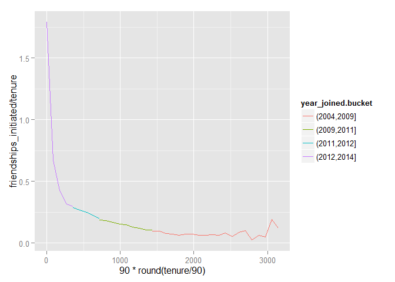
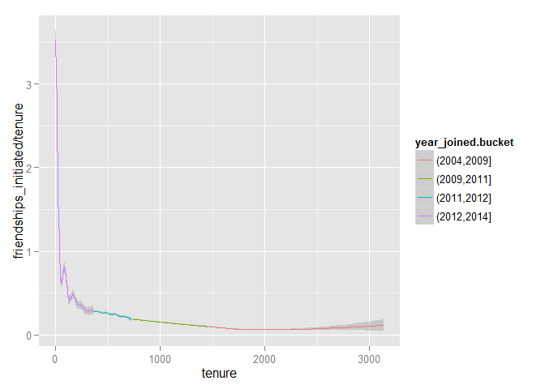

# Exploring many variaables
Shankar  
October 2, 2016  


```r
knitr::opts_chunk$set(fig.path = "README_figs/README-")
library(ggplot2)
library(dplyr)
```

```
## Warning: package 'dplyr' was built under R version 3.2.3
```

```
## 
## Attaching package: 'dplyr'
## 
## The following objects are masked from 'package:stats':
## 
##     filter, lag
## 
## The following objects are masked from 'package:base':
## 
##     intersect, setdiff, setequal, union
```

```r
fbdata <- read.csv("https://s3.amazonaws.com/udacity-hosted-downloads/ud651/pseudo_facebook.tsv", sep = '\t')

pf.fc_by_age <- fbdata %>%
  group_by(age) %>%
  summarise(friend_count_mean= mean(friend_count),
                          friend_count_median= median(friend_count),
                          n=n())%>%
  arrange(age)
head(pf.fc_by_age)
```

```
## Source: local data frame [6 x 4]
## 
##     age friend_count_mean friend_count_median     n
##   (int)             (dbl)               (dbl) (int)
## 1    13          164.7500                74.0   484
## 2    14          251.3901               132.0  1925
## 3    15          347.6921               161.0  2618
## 4    16          351.9371               171.5  3086
## 5    17          350.3006               156.0  3283
## 6    18          331.1663               162.0  5196
```


```
##    Min. 1st Qu.  Median    Mean 3rd Qu.    Max.    NA's 
##    2005    2012    2012    2012    2013    2014       2
```

```
## 
##  2005  2006  2007  2008  2009  2010  2011  2012  2013  2014 
##     9    15   581  1507  4557  5448  9860 33366 43588    70
```

 

friendship rate by tenure

```r
ggplot(aes(x=tenure, y= friendships_initiated/tenure),
       data=subset(fbdata, tenure >=1))+
  geom_line(aes(color= year_joined.bucket), stat = 'summary', fun.y=mean)
```

 

```r
ggplot(aes(x=90*round(tenure/90), y= friendships_initiated/tenure),
       data=subset(fbdata, tenure >=1))+
  geom_line(aes(color= year_joined.bucket), stat = 'summary', fun.y=mean)
```

 

```r
ggplot(aes(x=tenure, y= friendships_initiated/tenure),
       data=subset(fbdata, tenure >=1))+
  geom_smooth(aes(color= year_joined.bucket))
```

```
## geom_smooth: method="auto" and size of largest group is >=1000, so using gam with formula: y ~ s(x, bs = "cs"). Use 'method = x' to change the smoothing method.
```

 

Yogurt data set


```r
yo=read.csv("https://s3.amazonaws.com/udacity-hosted-downloads/ud651/yogurt.csv")

yo <- transform(yo, all.purchases=strawberry+blueberry+pina.colada+
                  plain+mixed.berry)
```


looping of plots


```r
set.seed(4231)
yo$id <- as.factor(yo$id)
sample.ids <- sample(levels(yo$id),16)


ggplot(aes(x=time, y= price), data = subset(yo, id %in% sample.ids))+
  facet_wrap(~id)+
  geom_line()+
  geom_point(aes(size=all.purchases), pch=1)
```

 

looping plots for categorical variables
Scatterplot matrix


```r
library(GGally)
```

```
## 
## Attaching package: 'GGally'
## 
## The following object is masked from 'package:dplyr':
## 
##     nasa
```

```r
theme_set(theme_minimal(20))

set.seed(1836)
pf_subset <- fbdata[,c(2:15)]
names(pf_subset)
```

```
##  [1] "age"                   "dob_day"              
##  [3] "dob_year"              "dob_month"            
##  [5] "gender"                "tenure"               
##  [7] "friend_count"          "friendships_initiated"
##  [9] "likes"                 "likes_received"       
## [11] "mobile_likes"          "mobile_likes_received"
## [13] "www_likes"             "www_likes_received"
```

```r
ggpairs(pf_subset[sample.int(nrow(pf_subset),1000),])
```

```
## stat_bin: binwidth defaulted to range/30. Use 'binwidth = x' to adjust this.
## stat_bin: binwidth defaulted to range/30. Use 'binwidth = x' to adjust this.
## stat_bin: binwidth defaulted to range/30. Use 'binwidth = x' to adjust this.
## stat_bin: binwidth defaulted to range/30. Use 'binwidth = x' to adjust this.
## stat_bin: binwidth defaulted to range/30. Use 'binwidth = x' to adjust this.
## stat_bin: binwidth defaulted to range/30. Use 'binwidth = x' to adjust this.
## stat_bin: binwidth defaulted to range/30. Use 'binwidth = x' to adjust this.
## stat_bin: binwidth defaulted to range/30. Use 'binwidth = x' to adjust this.
## stat_bin: binwidth defaulted to range/30. Use 'binwidth = x' to adjust this.
## stat_bin: binwidth defaulted to range/30. Use 'binwidth = x' to adjust this.
## stat_bin: binwidth defaulted to range/30. Use 'binwidth = x' to adjust this.
## stat_bin: binwidth defaulted to range/30. Use 'binwidth = x' to adjust this.
## stat_bin: binwidth defaulted to range/30. Use 'binwidth = x' to adjust this.
## stat_bin: binwidth defaulted to range/30. Use 'binwidth = x' to adjust this.
## stat_bin: binwidth defaulted to range/30. Use 'binwidth = x' to adjust this.
## stat_bin: binwidth defaulted to range/30. Use 'binwidth = x' to adjust this.
## stat_bin: binwidth defaulted to range/30. Use 'binwidth = x' to adjust this.
## stat_bin: binwidth defaulted to range/30. Use 'binwidth = x' to adjust this.
## stat_bin: binwidth defaulted to range/30. Use 'binwidth = x' to adjust this.
## stat_bin: binwidth defaulted to range/30. Use 'binwidth = x' to adjust this.
## stat_bin: binwidth defaulted to range/30. Use 'binwidth = x' to adjust this.
## stat_bin: binwidth defaulted to range/30. Use 'binwidth = x' to adjust this.
## stat_bin: binwidth defaulted to range/30. Use 'binwidth = x' to adjust this.
## stat_bin: binwidth defaulted to range/30. Use 'binwidth = x' to adjust this.
## stat_bin: binwidth defaulted to range/30. Use 'binwidth = x' to adjust this.
## stat_bin: binwidth defaulted to range/30. Use 'binwidth = x' to adjust this.
## stat_bin: binwidth defaulted to range/30. Use 'binwidth = x' to adjust this.
## stat_bin: binwidth defaulted to range/30. Use 'binwidth = x' to adjust this.
## stat_bin: binwidth defaulted to range/30. Use 'binwidth = x' to adjust this.
## stat_bin: binwidth defaulted to range/30. Use 'binwidth = x' to adjust this.
## stat_bin: binwidth defaulted to range/30. Use 'binwidth = x' to adjust this.
## stat_bin: binwidth defaulted to range/30. Use 'binwidth = x' to adjust this.
## stat_bin: binwidth defaulted to range/30. Use 'binwidth = x' to adjust this.
## stat_bin: binwidth defaulted to range/30. Use 'binwidth = x' to adjust this.
## stat_bin: binwidth defaulted to range/30. Use 'binwidth = x' to adjust this.
## stat_bin: binwidth defaulted to range/30. Use 'binwidth = x' to adjust this.
## stat_bin: binwidth defaulted to range/30. Use 'binwidth = x' to adjust this.
## stat_bin: binwidth defaulted to range/30. Use 'binwidth = x' to adjust this.
## stat_bin: binwidth defaulted to range/30. Use 'binwidth = x' to adjust this.
```

 

Genes 
Creating a heat map

```r
library(reshape2)
nci <- read.table("https://s3.amazonaws.com/udacity-hosted-downloads/ud651/nci.tsv")

nci.long.samp <- melt(as.matrix(nci[1:200,]))
names(nci.long.samp) <- c('gene', 'case','value')
head(nci.long.samp)
```

```
##   gene case  value
## 1    1   V1  0.300
## 2    2   V1  1.180
## 3    3   V1  0.550
## 4    4   V1  1.140
## 5    5   V1 -0.265
## 6    6   V1 -0.070
```

```r
ggplot(aes(x=case, y=gene, fill=value),
       data=nci.long.samp)+
  geom_tile()+
  scale_fill_gradientn(colours=colorRampPalette(c('blue', 'red'))(100))
```

 


Problem set solutions

```r
data(diamonds)

ggplot(aes(x=color, y=price), data=diamonds)+
  geom_histogram()
```

 


Note that the `echo = FALSE` parameter was added to the code chunk to prevent printing of the R code that generated the plot.
