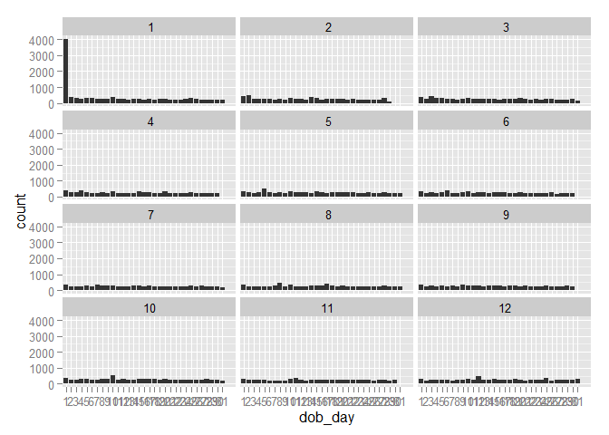
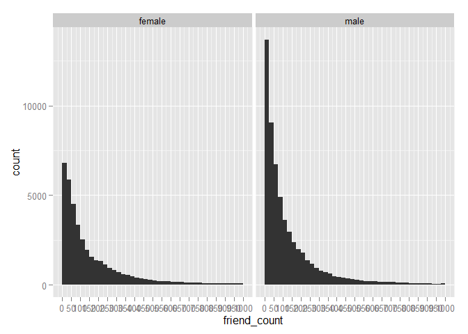
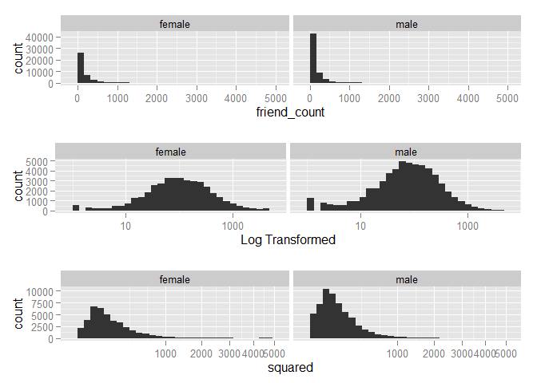
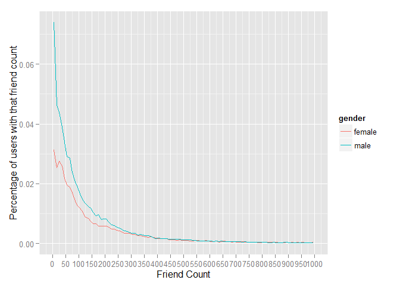
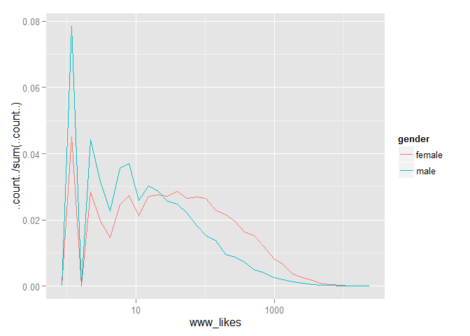
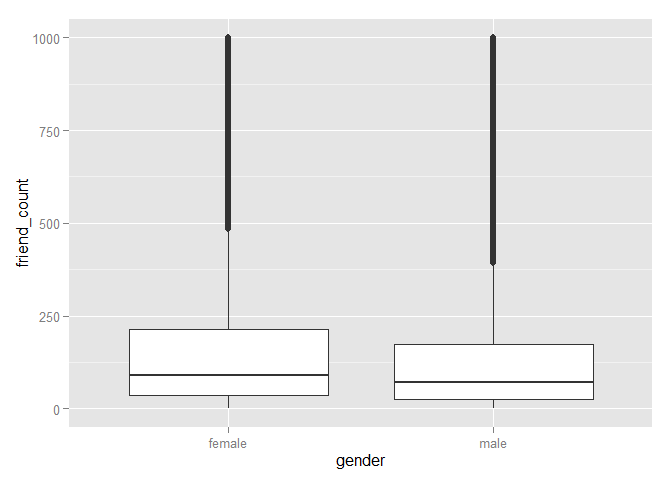

# Exploring one Variable
Shankar  
October 1, 2016  

This is an R Markdown document that I used to learn Data Analysis from udacity which explorees one variable


```r
fbdata <- read.csv("https://s3.amazonaws.com/udacity-hosted-downloads/ud651/pseudo_facebook.tsv", sep = '\t')
```

Histogram of birthdays

```r
library(ggplot2)
names(fbdata)
```

```
##  [1] "userid"                "age"                  
##  [3] "dob_day"               "dob_year"             
##  [5] "dob_month"             "gender"               
##  [7] "tenure"                "friend_count"         
##  [9] "friendships_initiated" "likes"                
## [11] "likes_received"        "mobile_likes"         
## [13] "mobile_likes_received" "www_likes"            
## [15] "www_likes_received"
```

```r
qplot(dob_day,data = fbdata) +
  scale_x_discrete(breaks= 1:31) +
  facet_wrap(~dob_month, ncol=3)
```

 


Friend count by gender

```r
#qplot(friend_count, data=fbdata, xlim = c(0,1000))

qplot(friend_count, data=subset(fbdata,!is.na(gender)), binwidth=25)+
  scale_x_continuous(limits=c(0,1000), breaks= seq(0,1000,50))+
  facet_wrap(~gender)
```

 
Table of gender count


```r
table(fbdata$gender)
```

```
## 
## female   male 
##  40254  58574
```
summary of friend count by gender

```r
by(fbdata$friend_count,fbdata$gender, summary)
```

```
## fbdata$gender: female
##    Min. 1st Qu.  Median    Mean 3rd Qu.    Max. 
##       0      37      96     242     244    4923 
## -------------------------------------------------------- 
## fbdata$gender: male
##    Min. 1st Qu.  Median    Mean 3rd Qu.    Max. 
##       0      27      74     165     182    4917
```

Scaling and Transoforming variabels

```r
p1= qplot(friend_count,data=subset(fbdata,!is.na(gender)))+facet_wrap(~gender)
p2= p1 + scale_x_log10() +xlab("Log Transformed")
p3=p1+ scale_x_sqrt() + xlab("squared")
library(gridExtra)
grid.arrange(p1,p2,p3, ncol=1)
```

```
## stat_bin: binwidth defaulted to range/30. Use 'binwidth = x' to adjust this.
## stat_bin: binwidth defaulted to range/30. Use 'binwidth = x' to adjust this.
## stat_bin: binwidth defaulted to range/30. Use 'binwidth = x' to adjust this.
## stat_bin: binwidth defaulted to range/30. Use 'binwidth = x' to adjust this.
## stat_bin: binwidth defaulted to range/30. Use 'binwidth = x' to adjust this.
## stat_bin: binwidth defaulted to range/30. Use 'binwidth = x' to adjust this.
```

 
Freequency ploygons


```r
ggplot(aes(x = friend_count, y = ..count../sum(..count..)), data = subset(fbdata, !is.na(gender))) + 
  geom_freqpoly(aes(color = gender), binwidth=10) + 
  scale_x_continuous(limits = c(0, 1000), breaks = seq(0, 1000, 50)) + 
  xlab('Friend Count') + 
  ylab('Percentage of users with that friend count')
```

```
## Warning: Removed 2 rows containing missing values (geom_path).
```

```
## Warning: Removed 2 rows containing missing values (geom_path).
```

 


```r
ggplot(aes(x = www_likes, y = ..count../sum(..count..)), data = subset(fbdata, !is.na(gender))) + 
  geom_freqpoly(aes(color = gender)) + 
  scale_x_log10()
```

```
## stat_bin: binwidth defaulted to range/30. Use 'binwidth = x' to adjust this.
```

 

Box plot of friend count by gender
outliers are 1.5 times IQR

```r
qplot(x=gender,y= friend_count,data = subset(fbdata,!is.na(gender)),
      geom = 'boxplot', ylim = c(0,1000))
```

```
## Warning: Removed 2949 rows containing non-finite values (stat_boxplot).
```

 

```r
qplot(x=gender,y= friend_count,data = subset(fbdata,!is.na(gender)),
      geom = 'boxplot')+ coord_cartesian(ylim = c(0,1000))
```

 


Summary of Suedo facebook data


```r
summary(fbdata)
```

```
##      userid             age            dob_day         dob_year   
##  Min.   :1000008   Min.   : 13.00   Min.   : 1.00   Min.   :1900  
##  1st Qu.:1298806   1st Qu.: 20.00   1st Qu.: 7.00   1st Qu.:1963  
##  Median :1596148   Median : 28.00   Median :14.00   Median :1985  
##  Mean   :1597045   Mean   : 37.28   Mean   :14.53   Mean   :1976  
##  3rd Qu.:1895744   3rd Qu.: 50.00   3rd Qu.:22.00   3rd Qu.:1993  
##  Max.   :2193542   Max.   :113.00   Max.   :31.00   Max.   :2000  
##                                                                   
##    dob_month         gender          tenure        friend_count   
##  Min.   : 1.000   female:40254   Min.   :   0.0   Min.   :   0.0  
##  1st Qu.: 3.000   male  :58574   1st Qu.: 226.0   1st Qu.:  31.0  
##  Median : 6.000   NA's  :  175   Median : 412.0   Median :  82.0  
##  Mean   : 6.283                  Mean   : 537.9   Mean   : 196.4  
##  3rd Qu.: 9.000                  3rd Qu.: 675.0   3rd Qu.: 206.0  
##  Max.   :12.000                  Max.   :3139.0   Max.   :4923.0  
##                                  NA's   :2                        
##  friendships_initiated     likes         likes_received    
##  Min.   :   0.0        Min.   :    0.0   Min.   :     0.0  
##  1st Qu.:  17.0        1st Qu.:    1.0   1st Qu.:     1.0  
##  Median :  46.0        Median :   11.0   Median :     8.0  
##  Mean   : 107.5        Mean   :  156.1   Mean   :   142.7  
##  3rd Qu.: 117.0        3rd Qu.:   81.0   3rd Qu.:    59.0  
##  Max.   :4144.0        Max.   :25111.0   Max.   :261197.0  
##                                                            
##   mobile_likes     mobile_likes_received   www_likes       
##  Min.   :    0.0   Min.   :     0.00     Min.   :    0.00  
##  1st Qu.:    0.0   1st Qu.:     0.00     1st Qu.:    0.00  
##  Median :    4.0   Median :     4.00     Median :    0.00  
##  Mean   :  106.1   Mean   :    84.12     Mean   :   49.96  
##  3rd Qu.:   46.0   3rd Qu.:    33.00     3rd Qu.:    7.00  
##  Max.   :25111.0   Max.   :138561.00     Max.   :14865.00  
##                                                            
##  www_likes_received 
##  Min.   :     0.00  
##  1st Qu.:     0.00  
##  Median :     2.00  
##  Mean   :    58.57  
##  3rd Qu.:    20.00  
##  Max.   :129953.00  
## 
```

Note that the `echo = FALSE` parameter was added to the code chunk to prevent printing of the R code that generated the plot.
