# Exploring Two Variabales
Shankar  
October 1, 2016  


```r
knitr::opts_chunk$set(fig.path = "README_figs/README-")
library(ggplot2)
fbdata <- read.csv("https://s3.amazonaws.com/udacity-hosted-downloads/ud651/pseudo_facebook.tsv", sep = '\t')
```

scatter plot  of age and friend count


```r
ggplot(aes(x=age,y=friend_count), data = subset(fbdata,!is.na(gender)))+geom_point()+
  xlim(13,90)
```

```
## Warning: Removed 4842 rows containing missing values (geom_point).
```

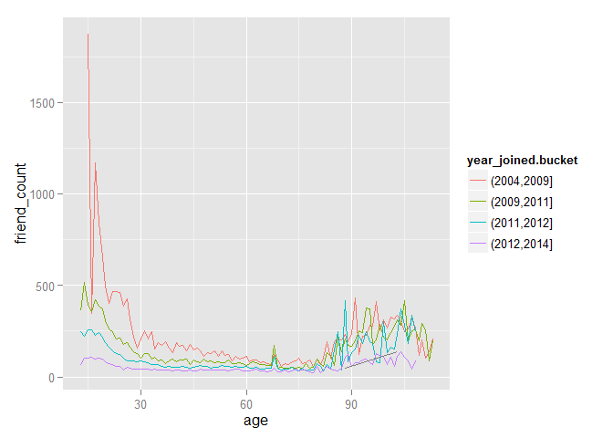 

```r
ggplot(aes(x=age,y=friend_count), data = subset(fbdata,!is.na(gender)))+geom_jitter(alpha= 1/20)+
  xlim(13,90)
```

```
## Warning: Removed 5117 rows containing missing values (geom_point).
```

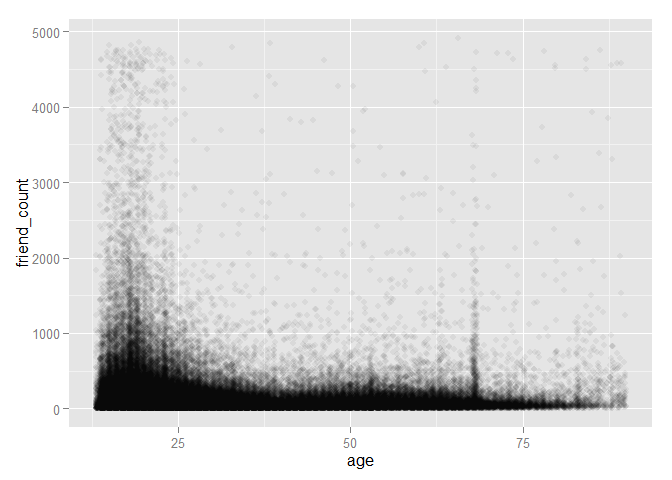 

```r
ggplot(aes(x=age,y=friend_count), data = subset(fbdata,!is.na(gender)))+geom_point(alpha= 1/20)+
  xlim(13,90)+ coord_trans(y = "sqrt")
```

```
## Warning: Removed 4842 rows containing missing values (geom_point).
```

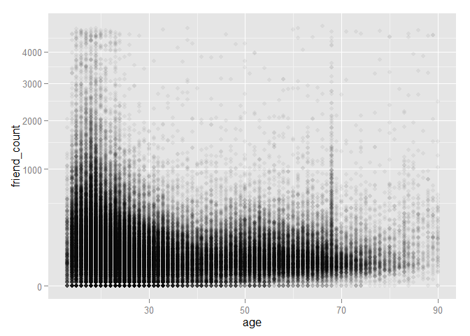 
Friendship initiated


```r
ggplot(aes(x=age,y=friendships_initiated), data= fbdata)+
  geom_point(alpha= 1/10, position = position_jitter(h=0))+
  coord_trans(y='sqrt')
```

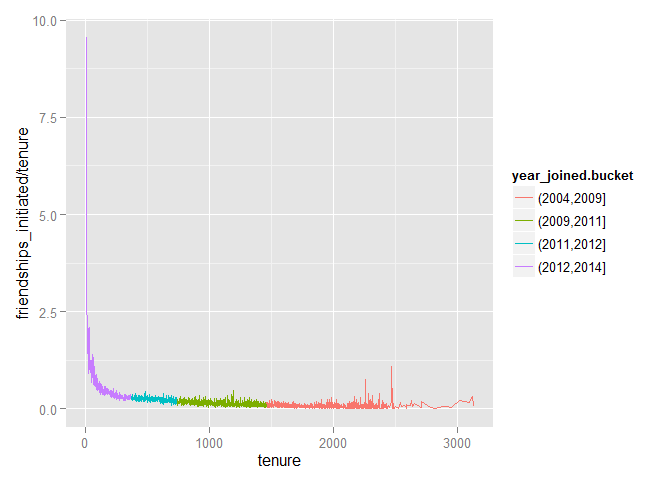 

Conditional means using dplyr
filter()
group_by()
mutate()
arrange()


```r
library(dplyr)
```

```
## Warning: package 'dplyr' was built under R version 3.2.3
```

```
## 
## Attaching package: 'dplyr'
## 
## The following objects are masked from 'package:stats':
## 
##     filter, lag
## 
## The following objects are masked from 'package:base':
## 
##     intersect, setdiff, setequal, union
```

```r
age_groups <- group_by(fbdata,age)
fc.fc_by_age <- summarise(age_groups,
                          friend_count_mean= mean(friend_count),
                          friend_count_median= median(friend_count),
                          n=n())

fc.fc_by_age<- arrange(fc.fc_by_age,age)
head(fc.fc_by_age)
```

```
## Source: local data frame [6 x 4]
## 
##     age friend_count_mean friend_count_median     n
##   (int)             (dbl)               (dbl) (int)
## 1    13          164.7500                74.0   484
## 2    14          251.3901               132.0  1925
## 3    15          347.6921               161.0  2618
## 4    16          351.9371               171.5  3086
## 5    17          350.3006               156.0  3283
## 6    18          331.1663               162.0  5196
```

```r
pf.fc_by_age <- fbdata %.%
  group_by(age) %.%
  summarise(friend_count_mean= mean(friend_count),
                          friend_count_median= median(friend_count),
                          n=n())%.%
  arrange(age)
```

```
## Warning: '%.%' is deprecated.
## Use '%>%' instead.
## See help("Deprecated")
```

```
## Warning: '%.%' is deprecated.
## Use '%>%' instead.
## See help("Deprecated")
```

```
## Warning: '%.%' is deprecated.
## Use '%>%' instead.
## See help("Deprecated")
```

```r
head(pf.fc_by_age)
```

```
## Source: local data frame [6 x 4]
## 
##     age friend_count_mean friend_count_median     n
##   (int)             (dbl)               (dbl) (int)
## 1    13          164.7500                74.0   484
## 2    14          251.3901               132.0  1925
## 3    15          347.6921               161.0  2618
## 4    16          351.9371               171.5  3086
## 5    17          350.3006               156.0  3283
## 6    18          331.1663               162.0  5196
```

```r
ggplot(aes(x=age,y=friend_count_mean), data =pf.fc_by_age) +geom_line()
```

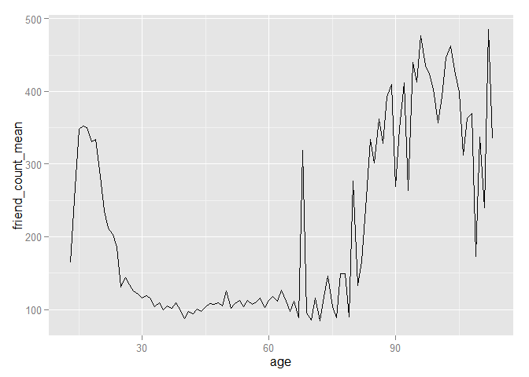 
Overlaying summaries

```r
ggplot(aes(x=age, y=friend_count),data= fbdata)+
  xlim(13,90)+
  geom_point(alpha=0.05, position = position_jitter(h=0),
             color='red')+
  coord_trans(y='sqrt')+
  geom_line(stat = 'summary', fun.y= mean)+
  geom_line(stat = 'summary', fun.y= quantile, probs=0.1,
            linetype= 2, color= 'blue')+
  geom_line(stat = 'summary', fun.y= quantile, probs=0.5,
            color= 'blue')+
  geom_line(stat = 'summary', fun.y= quantile, probs=0.9,
            linetype= 2, color= 'blue')+
  geom_line(stat = 'summary', fun.y= median, probs=0.1,
            linetype= 2, color= 'yellow')
```

```
## Warning: Removed 4906 rows containing missing values (stat_summary).
```

```
## Warning: Removed 4906 rows containing missing values (stat_summary).
```

```
## Warning: Removed 4906 rows containing missing values (stat_summary).
```

```
## Warning: Removed 4906 rows containing missing values (stat_summary).
```

```
## Warning: Removed 4906 rows containing missing values (stat_summary).
```

```
## Warning: Removed 5169 rows containing missing values (geom_point).
```

 

Correlation


```r
ggplot(aes(x=www_likes_received, y=likes_received), data = fbdata)+
  geom_point()+
  xlim(0,quantile(fbdata$www_likes_received,0.95))+
  ylim(0, quantile(fbdata$likes_received,0.95))+
  geom_smooth(method='lm',color='red')
```

```
## Warning: Removed 6075 rows containing missing values (stat_smooth).
```

```
## Warning: Removed 6075 rows containing missing values (geom_point).
```

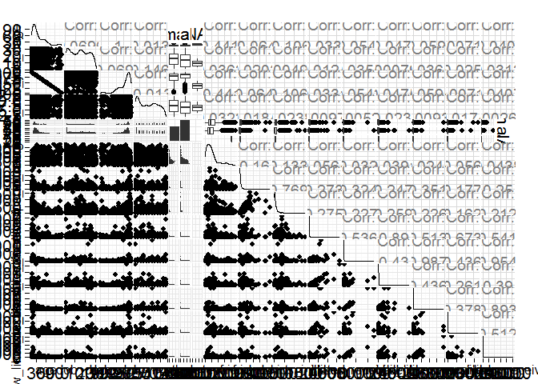 

```r
cor.test(fbdata$likes_received,fbdata$www_likes_received)
```

```
## 
## 	Pearson's product-moment correlation
## 
## data:  fbdata$likes_received and fbdata$www_likes_received
## t = 937.1, df = 99001, p-value < 2.2e-16
## alternative hypothesis: true correlation is not equal to 0
## 95 percent confidence interval:
##  0.9473553 0.9486176
## sample estimates:
##       cor 
## 0.9479902
```

Caution with correlation


```r
library(alr3)
```

```
## Loading required package: car
```

```r
data(Mitchell)
summary(Mitchell)
```

```
##      Month             Temp        
##  Min.   :  0.00   Min.   :-7.4778  
##  1st Qu.: 50.75   1st Qu.:-0.3486  
##  Median :101.50   Median :10.4500  
##  Mean   :101.50   Mean   :10.3125  
##  3rd Qu.:152.25   3rd Qu.:20.4306  
##  Max.   :203.00   Max.   :27.6056
```

```r
ggplot(aes(x=Month,y=Temp), data=Mitchell)+
  geom_point()+
  scale_x_discrete(breaks= seq(0,203,12))
```

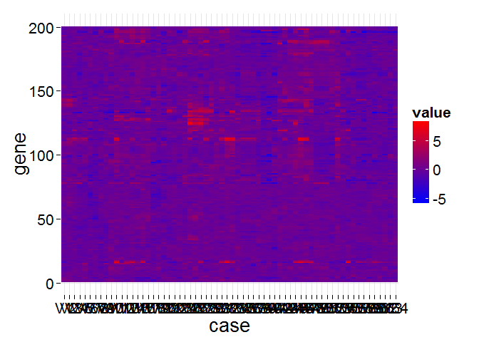 

Test

```r
data(diamonds)
ggplot(aes(x=price,y=x),data=diamonds)+
  geom_point()
```

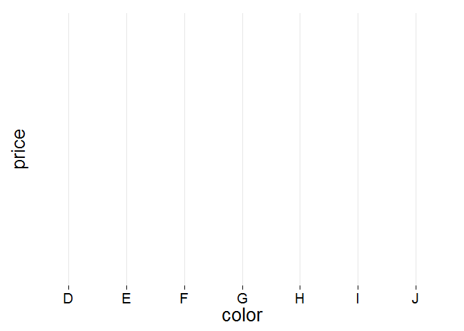 

```r
ggplot(aes(x=price,y=depth),data=diamonds)+
  geom_point()
```

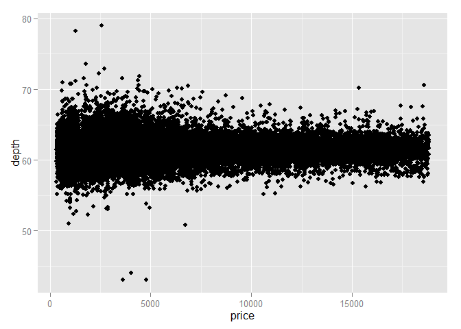 

```r
ggplot(aes(x=price,y=carat),data=diamonds)+
  geom_point()+
  xlim(0, quantile(diamonds$price,0.99))+
  ylim(0,quantile(diamonds$carat,0.99))
```

```
## Warning: Removed 926 rows containing missing values (geom_point).
```

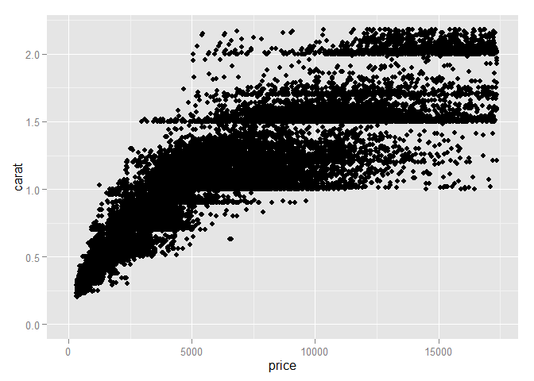 

```r
volume = diamonds$x*diamonds$y*diamonds$z

ggplot(aes(x=price,y=volume),data=diamonds)+
  geom_point()+
  geom_smooth(method='lm')
```

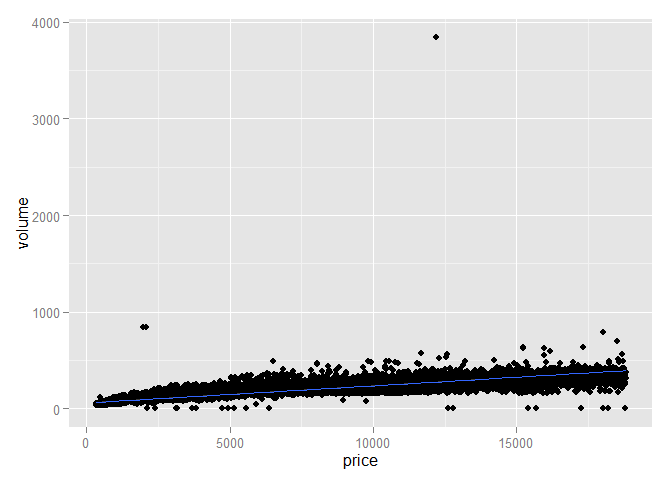 


diamondsByClarity

```r
diamondsByClarity <- diamonds %.%
  group_by(clarity)%.%
  summarise(mean_price= mean(price),
            median_price=median(price),
            min_price= min(price),
            max_price=max(price),
            n=n())%.%
  arrange(clarity)
```

```
## Warning: '%.%' is deprecated.
## Use '%>%' instead.
## See help("Deprecated")
```

```
## Warning: '%.%' is deprecated.
## Use '%>%' instead.
## See help("Deprecated")
```

```
## Warning: '%.%' is deprecated.
## Use '%>%' instead.
## See help("Deprecated")
```

```r
diamondsByClarity
```

```
## Source: local data frame [8 x 6]
## 
##   clarity mean_price median_price min_price max_price     n
##    (fctr)      (dbl)        (dbl)     (int)     (int) (int)
## 1      I1   3924.169         3344       345     18531   741
## 2     SI2   5063.029         4072       326     18804  9194
## 3     SI1   3996.001         2822       326     18818 13065
## 4     VS2   3924.989         2054       334     18823 12258
## 5     VS1   3839.455         2005       327     18795  8171
## 6    VVS2   3283.737         1311       336     18768  5066
## 7    VVS1   2523.115         1093       336     18777  3655
## 8      IF   2864.839         1080       369     18806  1790
```


Note that the `echo = FALSE` parameter was added to the code chunk to prevent printing of the R code that generated the plot.
